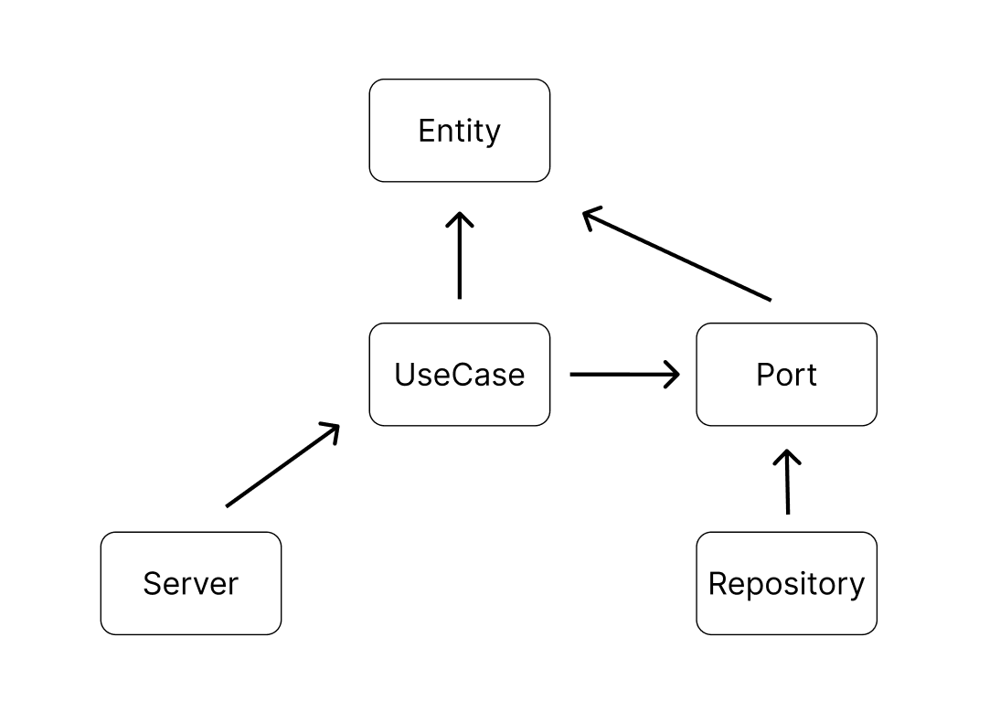

## Development
1. Open the folder in the dev container.
2. Run `make bash-app` in the terminal if you need.
3. Run `make protoc`.
4. Run `make migrate`.
5. Run `go mod tidy`.
6. Run `go run main.go`.

## Environment Variables
Please set the following environment variables used in PostgreSQL.
- PG_HOST
- PG_PORT
- PG_USERNAME
- PG_PASSWORD
- PG_DATABASE

## Note
- The `.proto` file is located in `server/pb/UserService.proto`.
- For more information about migration, see [here](https://github.com/golang-migrate/migrate/blob/master/database/postgres/TUTORIAL.md).

## Architecture
